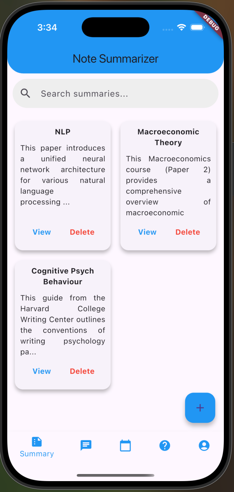

# Ace Me - Your AI-Powered Study Companion  

Ace Me is an all-in-one study assistant designed to help students study smarter, stay organized, and prioritize their mental well-being. With AI-powered tools for note summarization, personalized quizzes, and self-care resources, Ace Me is your ultimate academic companion.

## Features  
- **Summarize Notes:** AI-driven text summarization condenses lecture notes into key points for quick review.

- **Generate Quizzes:** Personalized quizzes help reinforce learning and track progress.  
- **Support Mental Well-Being:** Integrated self-care tools and AI chat support offer mindfulness exercises and stress management resources.  
- **Enhance Accessibility:** Customizable features like dark mode, adjustable font sizes, and voice support ensure an inclusive experience for all users.

## How We Built It  
- **Gemini API:** For advanced AI-powered text summarization and quiz generation.  
- **Flutter & Firebase:** A smooth, cross-platform app with real-time updates and seamless syncing.  
- **Mental Health Features:** Curated resources and AI-powered mindfulness support to help students maintain mental well-being.  
- **Accessibility Focus:** UI adjustments like dynamic font resizing, high-contrast mode, and full keyboard navigation.

## Getting Started  
1. Clone the repository:  
    ```bash
    git clone https://github.com/skarthik7/aceme.git
    ```
2. Install dependencies:  
    ```bash
    flutter pub get
    ```
3. Run the app on your device:  
    ```bash
    flutter run
    ```
